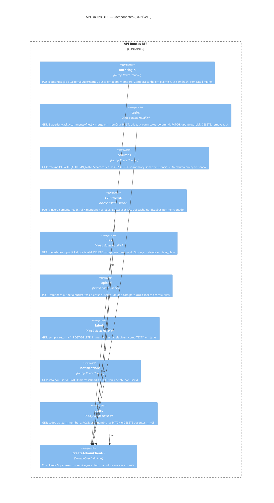

# C4 — Nível 3: Componentes

> Gerado pelo Architect em: 2026-05-29 | doc_level: detalhado

---

## Container: Kanban SPA (`app/page.tsx`)

```mermaid
C4Component
    title Kanban SPA — Componentes (C4 Nível 3)

    Container_Boundary(spa, "Kanban SPA (app/page.tsx)") {

        Component(root, "BroLabTask", "React Component (root)", "Orquestrador raiz. Gerencia todo o estado da aplicação: currentUser, team, columns+tasks, notifications, loading. Contém todos os handlers de ação.")

        Component(login, "LoginScreen", "React Component", "Tela de login. Aceita email ou @username. Chama onLogin passado pelo root.")

        Component(loading, "LoadingScreen", "React Component", "Tela de loading com mensagem dinâmica e barra animada.")

        Component(board, "KanbanBoard", "React Component", "Container do board. Recebe currentUser, team, columns. Gerencia abertura de modais (team, notifications, profile, newColumn).")

        Component(header, "Header", "React Component", "Cabeçalho sticky. Exibe usuário atual (com badge ADMIN), NotificationBell, botões de ação.")

        Component(bell, "NotificationBell", "React Component", "Ícone com contador de não lidas. animate-pulse quando unread > 0.")

        Component(column, "KanbanColumn", "React Component", "Coluna do Kanban. Contém lista de TaskCards + NewTaskForm. Botão para deletar coluna.")

        Component(taskcard, "TaskCard", "React Component", "Card de task. Exibe título, labels, assignees, contadores (comentários, arquivos). Botões de movimento (←→▲▼) e delete.")

        Component(taskedit, "TaskEditModal", "React Component", "Modal de edição de task. Campos: título, descrição, assignees (toggle), LabelManager, upload de arquivo, histórico de comentários + MentionInput.")

        Component(mention, "MentionInput", "React Component", "Textarea com autocomplete de @menções. Detecta posição do '@', filtra team, substitui token ao selecionar.")

        Component(labelmanager, "LabelManager", "React Component", "Gerenciador de labels da task. Adiciona/remove labels por nome. Exibe LabelBadge.")

        Component(labelbadge, "LabelBadge", "React Component", "Badge colorido para label. Cor calculada por getLabelColor (hash do nome).")

        Component(newcolumn, "NewColumnForm", "React Component", "Formulário inline para adicionar nova coluna. Chama onAddColumn.")

        Component(newtask, "NewTaskForm", "React Component", "Formulário inline para criar task na coluna. Chama onAddTask.")

        Component(team_modal, "TeamAdminModal", "React Component", "Modal de gestão do time. Lista membros. Admin vê badge ADMIN_MODE, botão DEL por membro, formulário NEW_USER_ENTRY.")

        Component(profile_modal, "ProfileEditModal", "React Component", "Modal de edição de perfil do usuário logado. ⚠️ Salvar falha (PATCH /api/users → 405).")

        Component(notif_modal, "NotificationsModal", "React Component", "Modal de notificações. Lista notificações do usuário. Ações: marcar como lida, limpar todas.")
    }

    Rel(root, login, "Renderiza quando !currentUser")
    Rel(root, loading, "Renderiza quando isLoading=true")
    Rel(root, board, "Renderiza quando autenticado")
    Rel(board, header, "Compõe")
    Rel(board, column, "Renderiza N colunas")
    Rel(board, team_modal, "Abre quando showTeam=true")
    Rel(board, notif_modal, "Abre quando showNotifications=true")
    Rel(board, profile_modal, "Abre quando showProfile=true")
    Rel(header, bell, "Compõe")
    Rel(column, taskcard, "Renderiza N cards")
    Rel(column, newtask, "Renderiza form inline")
    Rel(column, newcolumn, "Renderiza em última coluna")
    Rel(taskcard, taskedit, "Abre modal ao clicar")
    Rel(taskedit, mention, "Usa para input de comentário")
    Rel(taskedit, labelmanager, "Usa para gestão de labels")
    Rel(labelmanager, labelbadge, "Renderiza por label")
```



---

## Container: API Routes BFF (`app/api/**/route.ts`)



---

## Hierarquia de Estado (BroLabTask Root)

```
BroLabTask (root state)
├── currentUser: TeamMember | null
│   └── { id, name, username, email, role, isAdmin }
├── team: TeamMember[]
├── columns: Column[]
│   └── Column: { id, name, tasks: Task[] }
│       └── Task: { id, title, description, columnId, position,
│                   assignees[], labels[], comments[], files[] }
│           ├── Comment: { id, text, author, createdAt }
│           └── File: { id, name, size, type, publicUrl }
├── notifications: Notification[]
│   └── { id, type, message, taskId, taskTitle, fromUser, createdAt, read }
├── isLoading: boolean
└── loadingMessage: string
```

> 🟢 CONFIRMADO — Todo o estado da aplicação vive neste componente raiz. Prop drilling para componentes filhos.
