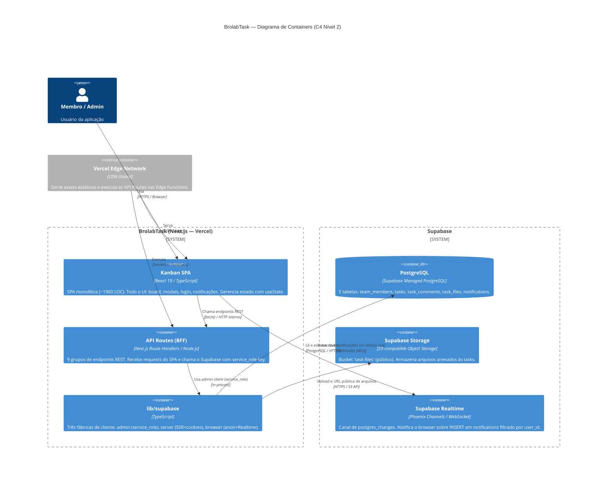

# C4 — Nível 2: Containers

> Gerado pelo Architect em: 2026-05-29 | doc_level: detalhado

---

## Descrição

O diagrama de containers detalha os processos e armazenamentos que compõem o BrolabTask e o Supabase.

---

## Diagrama

---

## Descrição dos Containers

### Kanban SPA (`app/page.tsx`)
| Atributo | Valor |
|----------|-------|
| Tecnologia | React 19, TypeScript, Tailwind CSS 4 |
| Tamanho | ~1960 LOC em um único arquivo |
| Responsabilidade | Todo o UI e lógica de apresentação da aplicação |
| Estado | `useState` em `BroLabTask` (root) — sem Context, Redux ou Zustand |
| Realtime | Supabase browser client para channel `notifications_user_{id}` |
| Dependências externas | `fetch()` para as API Routes; `createBrowserClient` para Realtime |

**17 componentes internos:**
`BroLabTask`, `KanbanBoard`, `KanbanColumn`, `TaskCard`, `TaskEditModal`, `NewTaskForm`, `NewColumnForm`, `Header`, `NotificationBell`, `NotificationsModal`, `TeamAdminModal`, `ProfileEditModal`, `LabelManager`, `LabelBadge`, `MentionInput`, `LoadingScreen`, `LoginScreen`

---

### API Routes BFF (`app/api/**/route.ts`)
| Atributo | Valor |
|----------|-------|
| Tecnologia | Next.js Route Handlers (Node.js serverless) |
| Padrão | REST via fetch nativo |
| Autenticação | ❌ Nenhuma — endpoints abertos |
| Supabase client | `createAdminClient()` (service_role, sem RLS) |

**9 grupos de endpoints:**

| Grupo | Métodos | Observação |
|-------|---------|------------|
| `/api/auth/login` | POST | Autenticação customizada |
| `/api/tasks` | GET, POST, PATCH, DELETE | CRUD com agregação |
| `/api/columns` | GET, POST, DELETE | ⚠️ Hardcoded — sem banco |
| `/api/comments` | POST | Com dispatch de @mentions |
| `/api/files` | GET, DELETE | Metadados de arquivos |
| `/api/upload` | POST | Multipart + Supabase Storage |
| `/api/labels` | GET, POST, DELETE | ⚠️ In-memory — sem banco |
| `/api/notifications` | GET, PATCH, DELETE | REST para read/clear |
| `/api/users` | GET, POST | ⚠️ PATCH e DELETE ausentes → 405 |

---

### lib/supabase
| Arquivo | Client | Uso |
|---------|--------|-----|
| `admin.ts` | `service_role` + `persistSession:false` | API Routes — acesso total sem RLS |
| `server.ts` | `anon` + cookies SSR | Disponível para SSR (pouco usado atualmente) |
| `client.ts` | `anon` + browser | Realtime subscription no SPA |

---

### PostgreSQL (Supabase)
5 tabelas principais — ver [erd-complete.md](./erd-complete.md) para detalhes completos.

---

### Supabase Storage
- Bucket: `task-files` (público, autocriado na primeira chamada de upload)
- Path: `{task_id}/{uuid}.{extensão}`
- Acesso: URL pública permanente via `getPublicUrl()`

---

### Supabase Realtime
- Protocolo: Phoenix Channels sobre WebSocket
- Evento escutado: `INSERT` em `public.notifications`
- Filtro: `user_id=eq.{currentUser.id}`
- Comportamento: novo registro → `setNotifications(prev => [newNotif, ...prev])`
