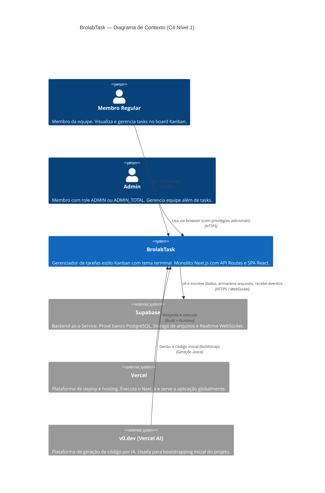

# C4 — Nível 1: Contexto

> Gerado pelo Architect em: 2026-05-29 | doc_level: detalhado

---

## Descrição

O diagrama de contexto mostra o BrolabTask no centro, os usuários que interagem com o sistema e os sistemas externos dos quais ele depende.

---

## Diagrama

---

## Personas de Usuário

| Persona | Descrição | Frequência de Uso |
|---------|-----------|------------------|
| **Membro Regular** | Desenvolvedor, designer ou outro colaborador. Cria e move tasks, comenta, anexa arquivos. | Diário |
| **Admin** | Líder técnico ou gestor. Além das ações de membro, gerencia a equipe (criação e remoção de membros). | Diário |

> 🟡 INFERIDO — Persona de Admin inferida a partir do campo `isAdmin` e das funcionalidades de `TeamAdminModal`. Não há documentação explícita de personas no projeto.

---

## Sistemas Externos

| Sistema | Papel | Protocolo | Confiança |
|---------|-------|-----------|-----------|
| **Supabase** | Banco de dados PostgreSQL, armazenamento de arquivos (S3-compat), notificações em tempo real (WebSocket) | HTTPS + WSS | 🟢 CONFIRMADO |
| **Vercel** | Hosting da aplicação Next.js, CI/CD automático por push no `main` | HTTPS / Git | 🟢 CONFIRMADO |
| **v0.dev** | Geração inicial do código (bootstrap histórico — não há dependência em runtime) | — | 🟢 CONFIRMADO |
| **@vercel/analytics** | Telemetria de uso da aplicação | HTTPS | 🟢 CONFIRMADO (dependência em `package.json`) |

---

## Contexto de Segurança

> ⚠️ **Ausência de boundary de segurança:** Não há autenticação nos endpoints de API. O sistema Supabase é acessado com service role (sem RLS). Qualquer agente externo que conheça as rotas de API tem acesso irrestrito aos dados.
