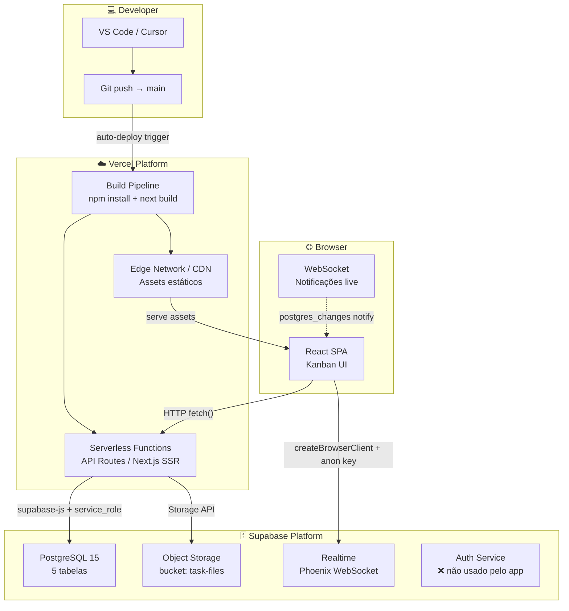

# Deployment

> Gerado pelo Architect em: 2026-05-29 | doc_level: detalhado
> Fontes: `vercel.json`, `next.config.mjs`, `package.json`, `lib/supabase/`, histórico de commits

---

## Visão Geral da Infraestrutura

O BrolabTask é uma aplicação **100% PaaS** — sem Docker, sem VMs, sem Kubernetes. Todo o runtime é gerenciado pelos provedores.



---

## Provedores e Serviços

### Vercel

| Atributo | Valor |
|----------|-------|
| **Framework** | Next.js (detecção automática) |
| **Build command** | `next build` |
| **Install command** | `npm install` |
| **Runtime** | Node.js (Serverless Functions para API Routes) |
| **Edge Network** | Sim — assets estáticos servidos globalmente |
| **Auto-deploy** | Push no branch `main` → deploy automático |
| **Preview deploys** | Disponível por padrão em outros branches |

**Arquivo `vercel.json`:**
```json
{
  "buildCommand": "next build",
  "installCommand": "npm install",
  "framework": "nextjs"
}
```

> 🟡 NOTA: O runtime de desenvolvimento usa Bun (`scripts/dev-server.mjs`) e o `pnpm-lock.yaml` está presente, mas o deploy em produção usa `npm install`. Inconsistência de package manager.

---

### Supabase

| Serviço | Uso | Tier |
|---------|-----|------|
| **PostgreSQL** | Dados da aplicação (5 tabelas) | Free / Pro |
| **Storage** | Arquivos anexados às tasks | Free / Pro |
| **Realtime** | Notificações em tempo real | Free / Pro |
| **Auth** | ❌ Não utilizado (auth customizada) | — |
| **RLS** | ❌ Desabilitado efetivamente (service_role bypassa) | — |

**URL do projeto:** `https://lmlouptvywbtswqlhnfb.supabase.co`

---

## Variáveis de Ambiente

| Variável | Escopo | Uso | Obrigatória |
|----------|--------|-----|-------------|
| `SUPABASE_URL` | Server | URL base do Supabase (lib/supabase/server.ts, admin.ts) | Sim |
| `SUPABASE_SERVICE_ROLE_KEY` | Server (secreto) | Admin client — acesso total sem RLS | Sim |
| `NEXT_PUBLIC_SUPABASE_URL` | Client | URL do Supabase para browser client | Sim |
| `NEXT_PUBLIC_SUPABASE_ANON_KEY` | Client | Anon key para Realtime | Sim¹ |
| `NEXT_PUBLIC_SUPABASE_PUBLISHABLE_KEY` | Client | Fallback se ANON_KEY ausente | Sim¹ |

> ¹ Pelo menos uma das duas keys de client deve estar definida. O código aceita `ANON_KEY || PUBLISHABLE_KEY`.

> 🔴 RISCO DE SEGURANÇA: `SUPABASE_SERVICE_ROLE_KEY` deve ser mantida **estritamente no servidor** (sem prefixo `NEXT_PUBLIC_`). Exposição desta chave no client daria acesso irrestrito ao banco.

---

## Pipeline CI/CD

```
1. Developer faz `git push origin main`
2. Vercel detecta o push via GitHub webhook
3. Vercel clona o repositório
4. Executa: npm install
5. Executa: next build
   - TypeScript: erros IGNORADOS (typescript.ignoreBuildErrors: true)
   - Imagens: não otimizadas (images.unoptimized: true)
6. Deploy para Edge Network
7. API Routes disponíveis como Serverless Functions
```

> 🟡 ATENÇÃO: `typescript.ignoreBuildErrors: true` significa que erros de tipo não bloqueiam o deploy. Bugs de tipo chegam silenciosamente à produção.

---

## Configuração Next.js (`next.config.mjs`)

```js
const nextConfig = {
  typescript: {
    ignoreBuildErrors: true,  // 🟡 Suprime erros de tipo no build
  },
  images: {
    unoptimized: true,        // 🟡 Desabilita otimização de imagens do Next.js
  },
}
```

---

## Desenvolvimento Local

| Ferramenta | Uso |
|-----------|-----|
| **Bun** | Runtime principal para dev local (`scripts/dev-server.mjs`) |
| **pnpm** | Package manager alternativo (lock file presente) |
| **npm** | Usado em produção (Vercel) |

**Comando de desenvolvimento:**
```bash
bun run dev
# ou
pnpm dev
# ou
npm run dev
```

---

## Topologia de Rede

| Conexão | Protocolo | Origem | Destino | Autenticação |
|---------|-----------|--------|---------|-------------|
| Browser → Vercel (SPA) | HTTPS | Browser | Vercel Edge | Nenhuma (app pública) |
| Browser → API Routes | HTTPS | Browser | Vercel Serverless | ❌ Nenhuma |
| Browser → Supabase Realtime | WSS | Browser | Supabase WebSocket | Anon Key (NEXT_PUBLIC) |
| API Routes → PostgreSQL | HTTPS | Vercel Serverless | Supabase REST API | Service Role Key |
| API Routes → Storage | HTTPS | Vercel Serverless | Supabase S3-compat | Service Role Key |

---

## Ausências Notáveis

| Item | Status | Impacto |
|------|--------|---------|
| Dockerfile | ❌ Ausente | Sem portabilidade para outros ambientes |
| docker-compose.yml | ❌ Ausente | Sem ambiente local isolado |
| `.env.example` | ❌ Ausente | Onboarding manual de desenvolvedores |
| Health check endpoint | ❌ Ausente | Sem monitoramento de disponibilidade |
| Logging estruturado | ❌ Ausente | Diagnóstico de produção limitado |
| Rate limiting | ❌ Ausente | API exposta a abuso |
| Testes (unit/integration/e2e) | ❌ Ausente | Sem cobertura automatizada |
| Staging environment | 🟡 Não configurado | Preview deploys da Vercel podem servir como staging |
