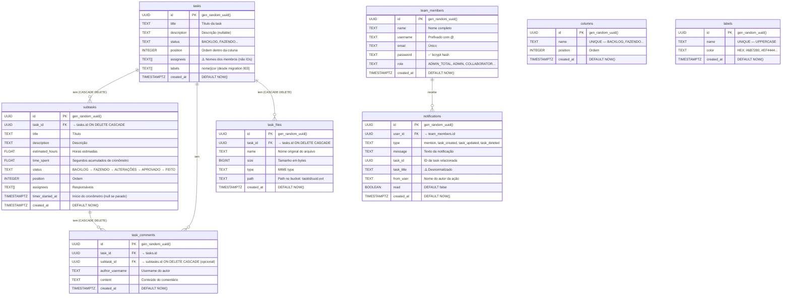

# ERD Completo — BrolabTask

> Gerado pelo Architect em: 2026-05-29 | doc_level: detalhado
> Fonte: `supabase/migrations/001_create_task_files.sql` + inferência a partir de `app/api/**/route.ts`

---

## Diagrama ER

---

## Tabelas em Detalhe

### `team_members`
| Campo | Tipo | Constraint | Observação |
|-------|------|------------|------------|
| `id` | UUID | PK, DEFAULT gen_random_uuid() | Identificador único |
| `name` | TEXT | NOT NULL | Nome completo exibido |
| `username` | TEXT | NOT NULL | Sempre prefixado com `@` (ex: `@joao.silva`) |
| `email` | TEXT | NOT NULL | Email de login |
| `password` | TEXT | NOT NULL | 🔴 **PLAINTEXT** — sem hash |
| `role` | TEXT | NOT NULL | String livre. Valores conhecidos: `ADMIN_TOTAL`, `ADMIN`, outros |
| `created_at` | TIMESTAMPTZ | DEFAULT NOW() | Data de criação |

**Índices confirmados:** PK em `id`
**Índices inferidos:** 🟡 Provavelmente sem índice em `email` ou `username` — queries de login fazem full scan

---

### `tasks`
| Campo | Tipo | Constraint | Observação |
|-------|------|------------|------------|
| `id` | UUID | PK, DEFAULT gen_random_uuid() | Identificador único |
| `title` | TEXT | NOT NULL | Título da task |
| `description` | TEXT | nullable | Descrição detalhada |
| `status` | TEXT | NOT NULL | Nome da coluna (funciona como columnId) |
| `position` | INTEGER | NOT NULL | Ordem dentro da coluna |
| `assignees` | TEXT[] | DEFAULT '{}' | 🟡 Nomes dos membros (sem FK) |
| `labels` | TEXT[] | DEFAULT '{}' | 🟡 Nomes das labels (sem tabela de labels) |
| `created_at` | TIMESTAMPTZ | DEFAULT NOW() | Data de criação |

> 🔴 **LACUNA:** Sem `updated_at`. Sem índice em `status` (filter frequente).

---

### `task_comments`
| Campo | Tipo | Constraint | Observação |
|-------|------|------------|------------|
| `id` | UUID | PK, DEFAULT gen_random_uuid() | Identificador único |
| `task_id` | UUID | FK → tasks.id | Sem CASCADE explícito nesta tabela |
| `text` | TEXT | NOT NULL | Conteúdo do comentário (pode conter @mentions) |
| `author` | TEXT | NOT NULL | Nome do autor (não ID — mesma desnormalização de assignees) |
| `created_at` | TIMESTAMPTZ | DEFAULT NOW() | Data de criação |

> 🟡 **INFERIDO:** Estrutura derivada das queries em `app/api/tasks/route.ts` e `app/api/comments/route.ts`. DDL não encontrado em migrations.

---

### `task_files`
| Campo | Tipo | Constraint | Observação |
|-------|------|------------|------------|
| `id` | UUID | PK, DEFAULT gen_random_uuid() | Identificador único |
| `task_id` | UUID | FK → tasks.id ON DELETE CASCADE | Deleção em cascata |
| `name` | TEXT | NOT NULL | Nome original do arquivo |
| `size` | BIGINT | NOT NULL | Tamanho em bytes |
| `type` | TEXT | NOT NULL | MIME type (ex: `image/png`) |
| `path` | TEXT | NOT NULL | Path no bucket: `{taskId}/{uuid}.{ext}` |
| `created_at` | TIMESTAMPTZ | DEFAULT NOW() | Data de upload |

**Índices confirmados:** PK em `id`, INDEX `idx_task_files_task_id` em `task_id`

---

### `notifications`
| Campo | Tipo | Constraint | Observação |
|-------|------|------------|------------|
| `id` | UUID | PK, DEFAULT gen_random_uuid() | Identificador único |
| `user_id` | UUID | FK → team_members.id | Destinatário da notificação |
| `type` | TEXT | NOT NULL | `mention` (único tipo emitido atualmente) |
| `message` | TEXT | NOT NULL | Texto da notificação |
| `task_id` | UUID | nullable | Task relacionada |
| `task_title` | TEXT | nullable | 🟡 Desnormalizado — título no momento da criação |
| `from_user` | TEXT | NOT NULL | Nome do usuário que disparou |
| `read` | BOOLEAN | DEFAULT false | Flag de leitura |
| `created_at` | TIMESTAMPTZ | DEFAULT NOW() | Data de criação |

> 🟡 **INFERIDO:** `task_id` e `task_title` inferidos a partir da interface TypeScript `Notification` em `app/page.tsx` e do código em `app/api/comments/route.ts`.

---

## Relacionamentos

| Relacionamento | Cardinalidade | Tipo | Implementação |
|---------------|---------------|------|---------------|
| tasks → task_comments | 1 : N | Física (FK) | `task_comments.task_id` |
| tasks → task_files | 1 : N | Física (FK + CASCADE) | `task_files.task_id` |
| team_members → notifications | 1 : N | Física (FK) | `notifications.user_id` |
| tasks → assignees | 1 : N | **Lógica** (TEXT[]) | `tasks.assignees[]` (nomes, sem FK) |
| tasks → labels | 1 : N | **Lógica** (TEXT[]) | `tasks.labels[]` (nomes, sem FK) |
| tasks → notifications | 1 : N | **Lógica** (TEXT) | `notifications.task_id` UUID sem FK declarado |

---

## Entidades Ausentes (Lacunas de Modelo)

| Entidade | Por que deveria existir | Impacto |
|----------|------------------------|---------|
| `columns` | Colunas hardcoded em código | Customização de workflow impossível |
| `labels` | Labels como `TEXT[]` sem rastreabilidade | Sem histórico, rename quebra cor |
| `task_assignees` | Tabela de junção tasks↔team_members | Integridade referencial para assignees |
| `sessions` / tokens | Autenticação sem estado server-side | Sem invalidação de sessão |
