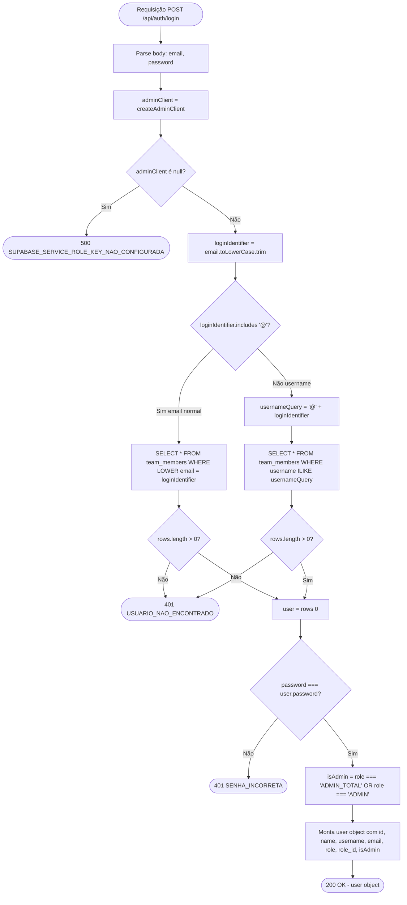

# Flowchart — Função `auth POST` (detalhado)

> Função: `POST /api/auth/login` — `app/api/auth/login/route.ts`
>
> Fluxo detalhado: lógica de normalização de identificador + dois caminhos de busca.

## Notas de segurança

| Ponto | Status | Risco |
|-------|--------|-------|
| Comparação de senha | `user.password !== password` | 🔴 CRÍTICO — plaintext |
| Rate limiting | Ausente | 🟡 ALTO — brute force |
| Logging de tentativas | Ausente | 🟡 MÉDIO |
| Expiração de sessão | Ausente (estado React) | 🔴 ALTO |
