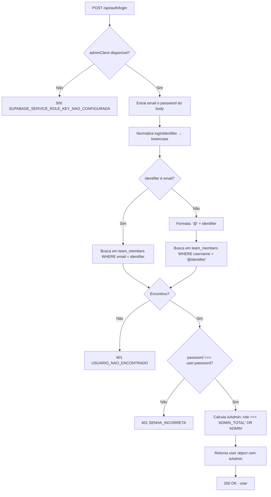

# Flowchart — Módulo `auth`

> `app/api/auth/login/route.ts`

```mermaid
flowchart TD
    A[POST /api/auth/login] --> B{adminClient disponível?}
    B -- Não --> ERR1[500 SUPABASE_SERVICE_ROLE_KEY_NAO_CONFIGURADA]
    B -- Sim --> C[Extrai email e password do body]
    C --> D[Normaliza loginIdentifier → lowercase]
    D --> E{identifier é email?}
    E -- Sim --> F[Busca em team_members WHERE email = identifier]
    E -- Não --> G[Formata: '@' + identifier]
    G --> H[Busca em team_members WHERE username = '@identifier']
    F --> I{Encontrou?}
    H --> I
    I -- Não --> ERR2[401 USUARIO_NAO_ENCONTRADO]
    I -- Sim --> J{password === user.password?}
    J -- Não --> ERR3[401 SENHA_INCORRETA]
    J -- Sim --> K[Calcula isAdmin: role === 'ADMIN_TOTAL' OR 'ADMIN']
    K --> L[Retorna user object com isAdmin]
    L --> M[200 OK - user]
```
