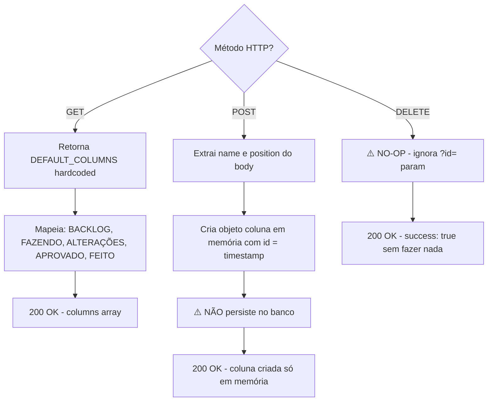

# Flowchart — Módulo `columns`

> `app/api/columns/route.ts`
>
> ⚠️ Colunas **não são persistidas** — totalmente em memória.

```mermaid
flowchart TD
    A{Método HTTP?}
    A -- GET --> B[Retorna DEFAULT_COLUMNS hardcoded]
    B --> C[Mapeia: BACKLOG, FAZENDO, ALTERAÇÕES, APROVADO, FEITO]
    C --> D[200 OK - columns array]

    A -- POST --> E[Extrai name e position do body]
    E --> F[Cria objeto coluna em memória com id = timestamp]
    F --> G[⚠️ NÃO persiste no banco]
    G --> H[200 OK - coluna criada só em memória]

    A -- DELETE --> I[⚠️ NO-OP - ignora ?id= param]
    I --> J[200 OK - success: true sem fazer nada]
```
