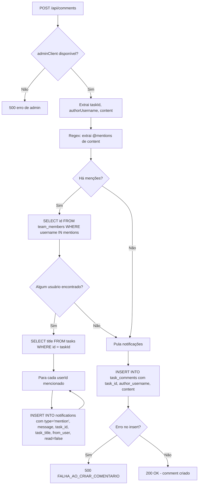

# Flowchart — Módulo `comments`

> `app/api/comments/route.ts`

```mermaid
flowchart TD
    A[POST /api/comments] --> B{adminClient disponível?}
    B -- Não --> ERR1[500 erro de admin]
    B -- Sim --> C[Extrai taskId, authorUsername, content]
    C --> D[Regex: extrai @mentions de content]
    D --> E{Há menções?}
    E -- Sim --> F[SELECT id FROM team_members WHERE username IN mentions]
    F --> G{Algum usuário encontrado?}
    G -- Sim --> H[SELECT title FROM tasks WHERE id = taskId]
    H --> I[Para cada userId mencionado]
    I --> J[INSERT INTO notifications com type='mention', message, task_id, task_title, from_user, read=false]
    J --> I
    G -- Não --> K[Pula notificações]
    E -- Não --> K
    K --> L[INSERT INTO task_comments com task_id, author_username, content]
    L --> M{Erro no insert?}
    M -- Sim --> ERR2[500 FALHA_AO_CRIAR_COMENTARIO]
    M -- Não --> N[200 OK - comment criado]
```
