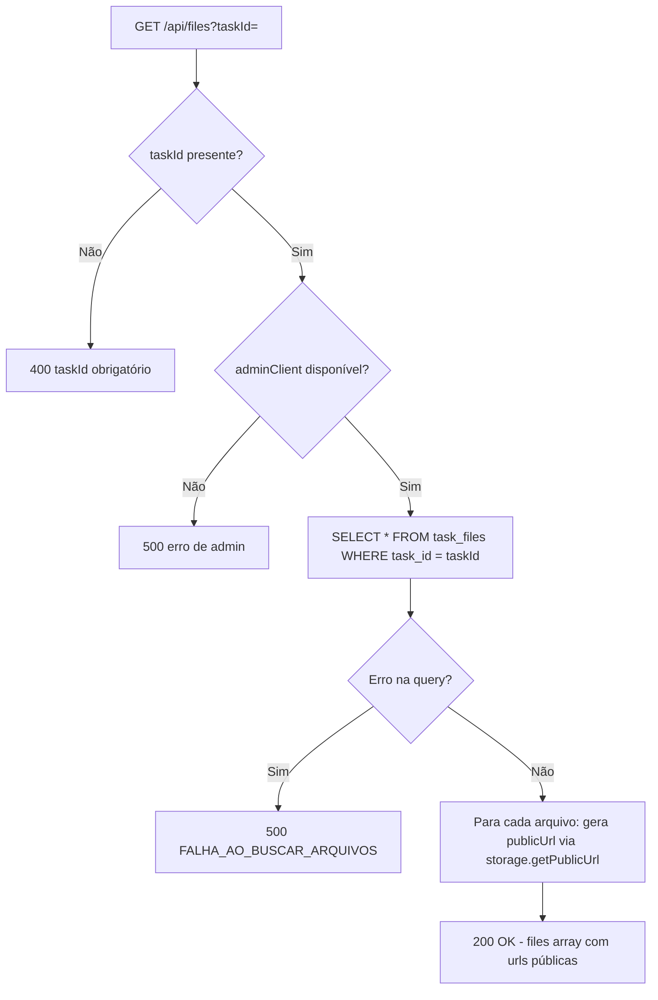
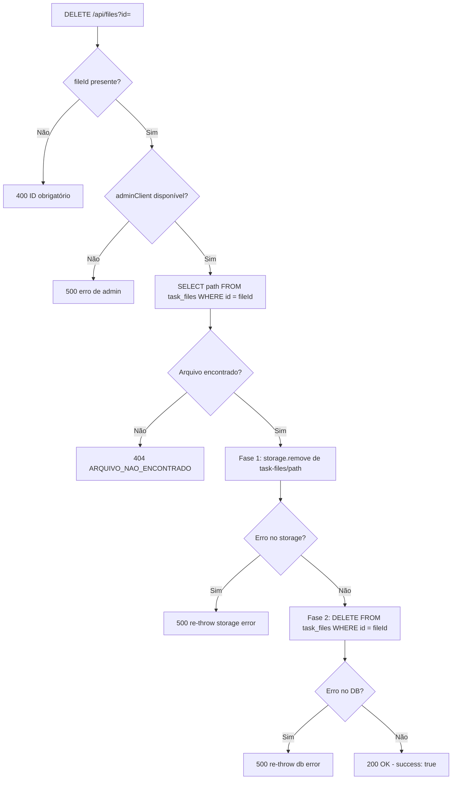

# Flowchart — Módulo `files`

> `app/api/files/route.ts`

## GET /api/files — Listar arquivos de uma tarefa

```mermaid
flowchart TD
    A[GET /api/files?taskId=] --> B{taskId presente?}
    B -- Não --> ERR1[400 taskId obrigatório]
    B -- Sim --> C{adminClient disponível?}
    C -- Não --> ERR2[500 erro de admin]
    C -- Sim --> D[SELECT * FROM task_files WHERE task_id = taskId]
    D --> E{Erro na query?}
    E -- Sim --> ERR3[500 FALHA_AO_BUSCAR_ARQUIVOS]
    E -- Não --> F[Para cada arquivo: gera publicUrl via storage.getPublicUrl]
    F --> G[200 OK - files array com urls públicas]
```

## DELETE /api/files — Exclusão two-phase

```mermaid
flowchart TD
    A[DELETE /api/files?id=] --> B{fileId presente?}
    B -- Não --> ERR1[400 ID obrigatório]
    B -- Sim --> C{adminClient disponível?}
    C -- Não --> ERR2[500 erro de admin]
    C -- Sim --> D[SELECT path FROM task_files WHERE id = fileId]
    D --> E{Arquivo encontrado?}
    E -- Não --> ERR3[404 ARQUIVO_NAO_ENCONTRADO]
    E -- Sim --> F[Fase 1: storage.remove de task-files/path]
    F --> G{Erro no storage?}
    G -- Sim --> ERR4[500 re-throw storage error]
    G -- Não --> H[Fase 2: DELETE FROM task_files WHERE id = fileId]
    H --> I{Erro no DB?}
    I -- Sim --> ERR5[500 re-throw db error]
    I -- Não --> J[200 OK - success: true]
```
