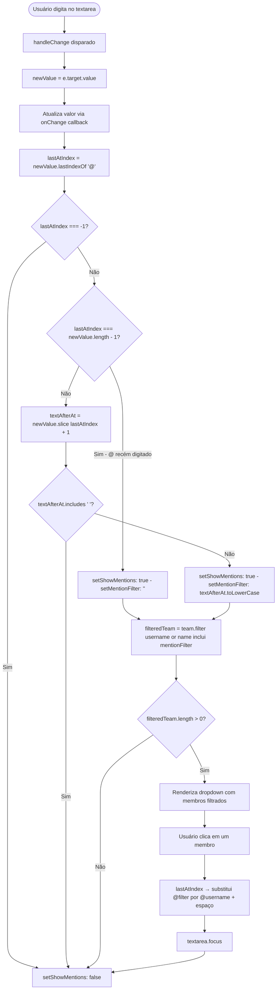

# Flowchart — Componente `MentionInput` (detalhado)

> Componente: `MentionInput` — `app/page.tsx`
>
> Autocomplete de @menções com filtro em tempo real sobre lista de membros.



## Exemplo de substituição

```
Antes:  "olá @jo"       (lastAtIndex = 4, textAfterAt = "jo")
Depois: "olá @joao.silva " (membro selecionado com username "joao.silva")
```
