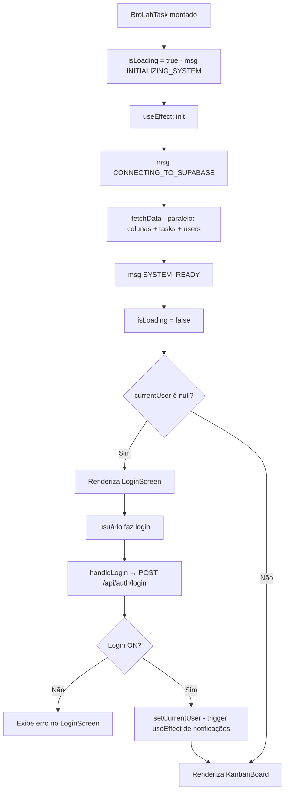
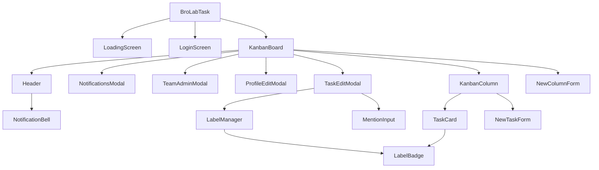
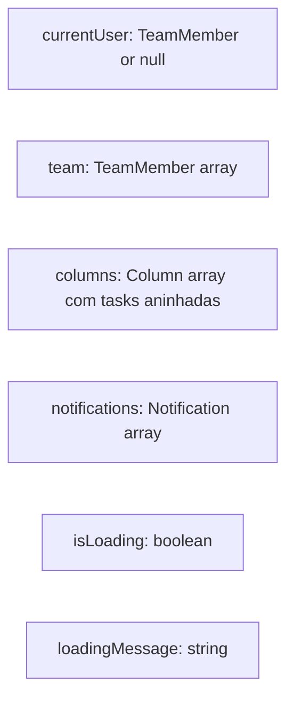
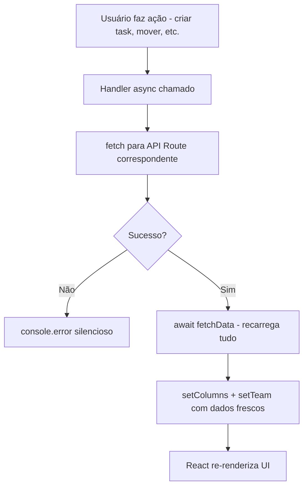
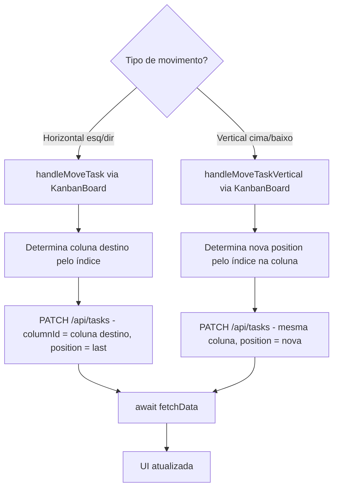

# Flowchart — Módulo `kanban-app`

> `app/page.tsx` — SPA monolítica (~1960 LOC)

## Fluxo de inicialização

## Hierarquia de componentes

## State global em BroLabTask

## Ciclo de atualização de dados

## Fluxo de movimento de task

