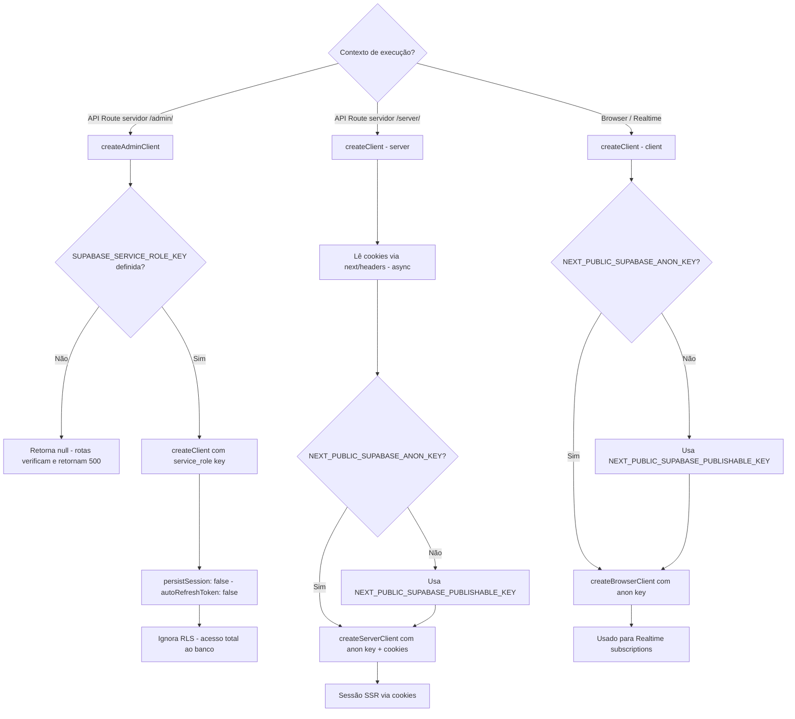
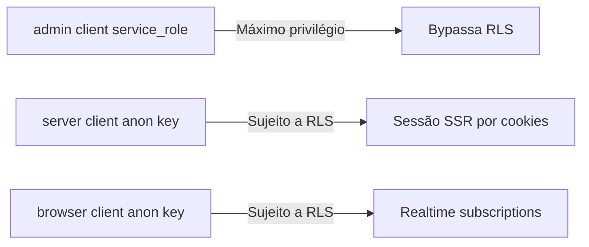

# Flowchart — Módulo `lib/supabase`

> `lib/supabase/admin.ts`, `lib/supabase/server.ts`, `lib/supabase/client.ts`

## Seleção de cliente por contexto

```mermaid
flowchart TD
    A{Contexto de execução?}
    A -- API Route servidor /admin/ --> B[createAdminClient]
    A -- API Route servidor /server/ --> C[createClient - server]
    A -- Browser / Realtime --> D[createClient - client]

    B --> E{SUPABASE_SERVICE_ROLE_KEY definida?}
    E -- Não --> F[Retorna null - rotas verificam e retornam 500]
    E -- Sim --> G[createClient com service_role key]
    G --> H[persistSession: false - autoRefreshToken: false]
    H --> I[Ignora RLS - acesso total ao banco]

    C --> J[Lê cookies via next/headers - async]
    J --> K{NEXT_PUBLIC_SUPABASE_ANON_KEY?}
    K -- Não --> L[Usa NEXT_PUBLIC_SUPABASE_PUBLISHABLE_KEY]
    K -- Sim --> M[createServerClient com anon key + cookies]
    L --> M
    M --> N[Sessão SSR via cookies]

    D --> O{NEXT_PUBLIC_SUPABASE_ANON_KEY?}
    O -- Não --> P[Usa NEXT_PUBLIC_SUPABASE_PUBLISHABLE_KEY]
    O -- Sim --> Q[createBrowserClient com anon key]
    P --> Q
    Q --> R[Usado para Realtime subscriptions]
```

## Hierarquia de privilégios

```mermaid
flowchart LR
    A[admin client service_role] -->|Máximo privilégio| B[Bypassa RLS]
    C[server client anon key] -->|Sujeito a RLS| D[Sessão SSR por cookies]
    E[browser client anon key] -->|Sujeito a RLS| F[Realtime subscriptions]
```
