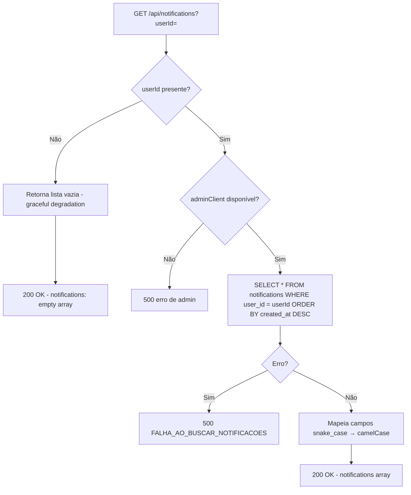
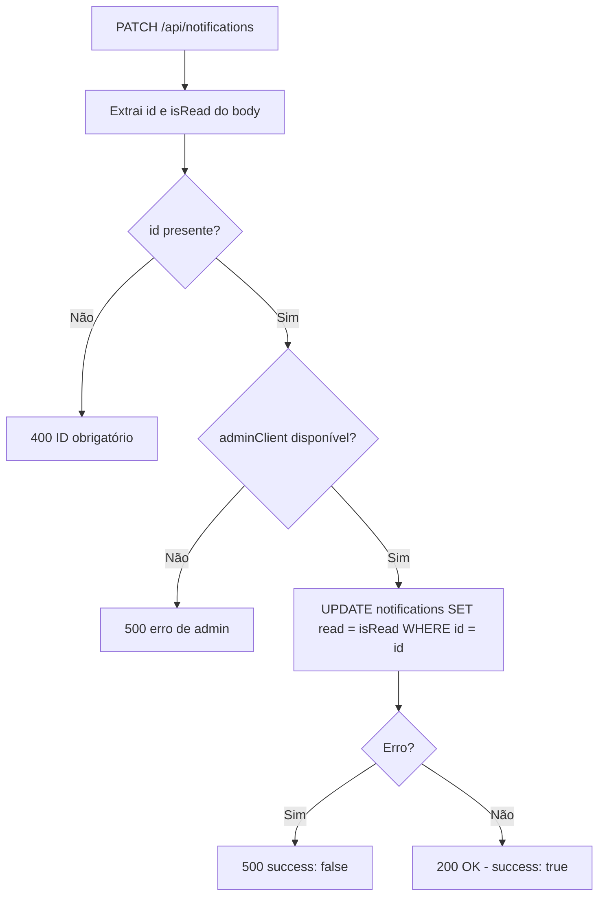
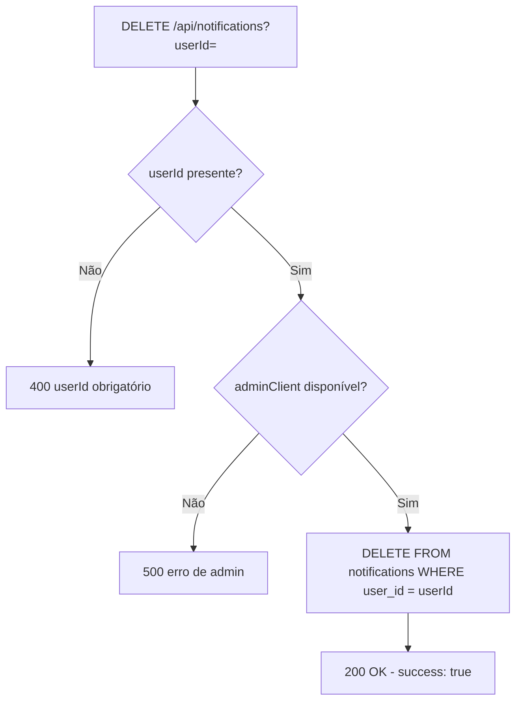
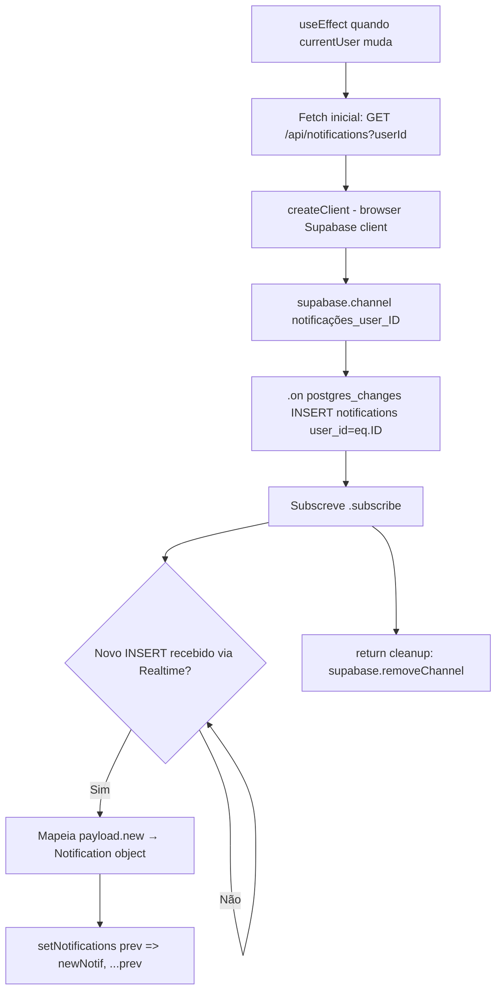

# Flowchart — Módulo `notifications`

> `app/api/notifications/route.ts`

## GET — Buscar notificações do usuário

## PATCH — Marcar notificação como lida

## DELETE — Limpar todas as notificações do usuário

## Realtime (Frontend)

