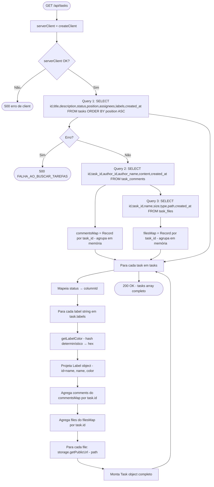
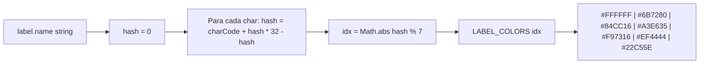

# Flowchart — Função `tasks GET aggregation` (detalhado)

> Função: `GET /api/tasks` — `app/api/tasks/route.ts`
>
> Fluxo detalhado: 3 queries + agregação em memória + projeção de tipos.

## Algoritmo getLabelColor

## Performance e complexidade

| Operação | Complexidade | Nota |
|----------|-------------|------|
| Queries ao banco | O(3) — fixo | Sem joins, 3 SELECT full-scan |
| Agrupamento em memória | O(n + m + p) | n=tasks, m=comments, p=files |
| Projeção de labels | O(tasks × labels) | Geralmente pequeno |
| getPublicUrl | O(files) | Chamada local ao SDK, sem HTTP |
