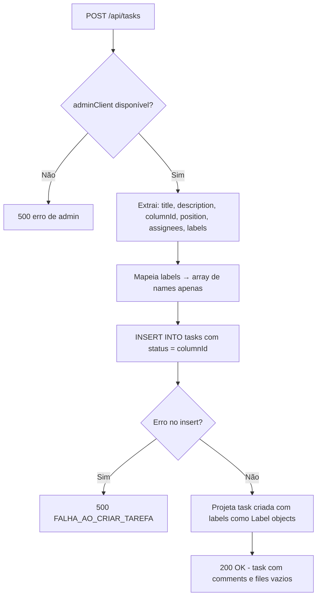
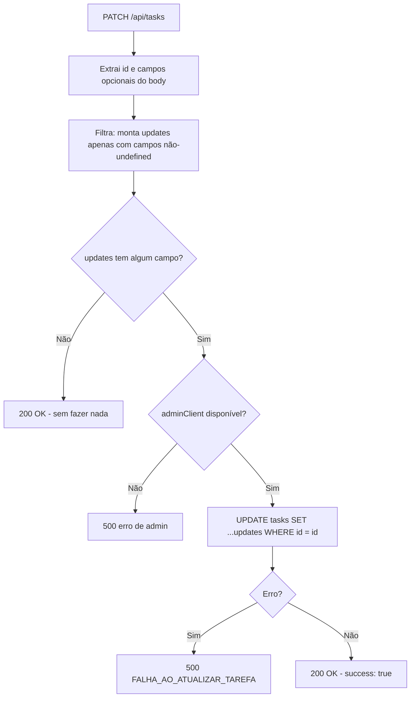
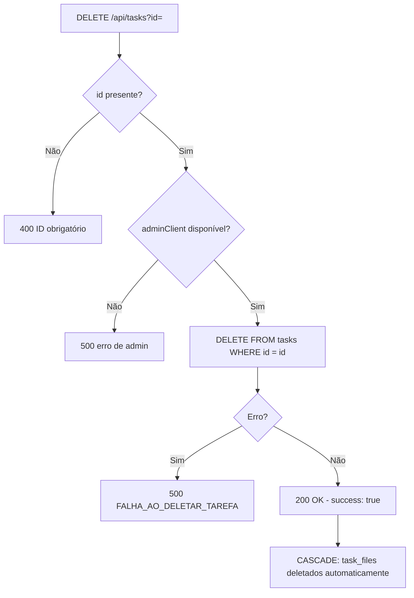

# Flowchart — Módulo `tasks`

> `app/api/tasks/route.ts`

## GET /api/tasks — Busca com agregação

```mermaid
flowchart TD
    A[GET /api/tasks] --> B{serverClient disponível?}
    B -- Não --> ERR1[500 erro de client]
    B -- Sim --> C[Query 1: SELECT * FROM tasks ORDER BY position ASC]
    C --> D[Query 2: SELECT * FROM task_comments]
    D --> E[Query 3: SELECT * FROM task_files]
    E --> F[Agrupa comentários por task_id em Record map]
    F --> G[Agrupa arquivos por task_id em Record map]
    G --> H{Para cada task}
    H --> I[Mapeia: status → columnId]
    I --> J[Projeta labels TEXT[] → Label objects com cor via getLabelColor]
    J --> K[Agrega comments e files pelo id da task]
    K --> L[Gera publicUrl para cada arquivo via storage.getPublicUrl]
    L --> M[200 OK - tasks array]
```

## POST /api/tasks — Criação



## PATCH /api/tasks — Atualização parcial



## DELETE /api/tasks — Exclusão


