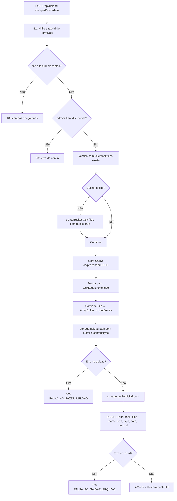

# Flowchart — Módulo `upload`

> `app/api/upload/route.ts`

```mermaid
flowchart TD
    A[POST /api/upload multipart/form-data] --> B[Extrai file e taskId do FormData]
    B --> C{file e taskId presentes?}
    C -- Não --> ERR1[400 campos obrigatórios]
    C -- Sim --> D{adminClient disponível?}
    D -- Não --> ERR2[500 erro de admin]
    D -- Sim --> E[Verifica se bucket task-files existe]
    E --> F{Bucket existe?}
    F -- Não --> G[createBucket task-files com public: true]
    G --> H[Continua]
    F -- Sim --> H
    H --> I[Gera UUID: crypto.randomUUID]
    I --> J[Monta path: taskId/uuid.extensao]
    J --> K[Converte File → ArrayBuffer → Uint8Array]
    K --> L[storage.upload path com buffer e contentType]
    L --> M{Erro no upload?}
    M -- Sim --> ERR3[500 FALHA_AO_FAZER_UPLOAD]
    M -- Não --> N[storage.getPublicUrl path]
    N --> O[INSERT INTO task_files - name, size, type, path, task_id]
    O --> P{Erro no insert?}
    P -- Sim --> ERR4[500 FALHA_AO_SALVAR_ARQUIVO]
    P -- Não --> Q[200 OK - file com publicUrl]
```
