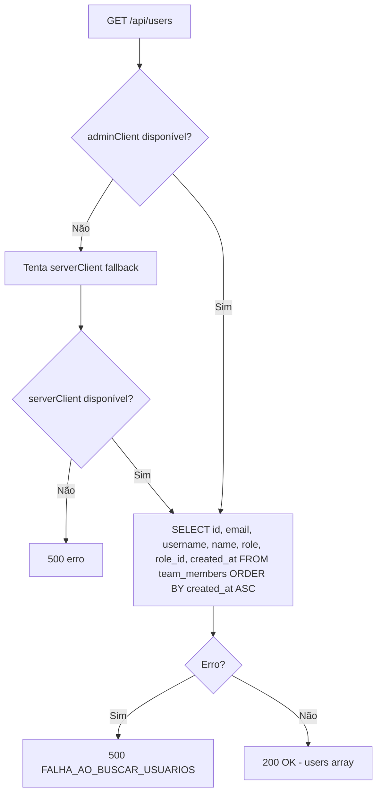
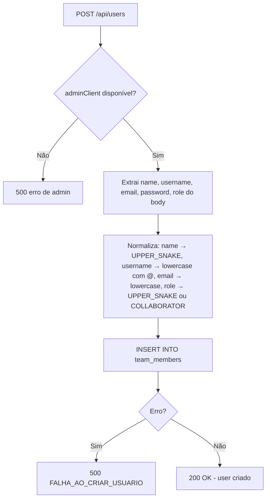
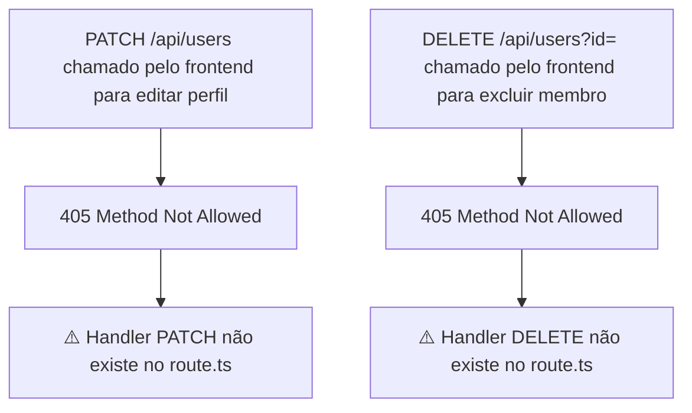

# Flowchart — Módulo `users`

> `app/api/users/route.ts`

## GET — Listar membros

```mermaid
flowchart TD
    A[GET /api/users] --> B{adminClient disponível?}
    B -- Não --> C[Tenta serverClient fallback]
    C --> D{serverClient disponível?}
    D -- Não --> ERR1[500 erro]
    D -- Sim --> E[SELECT id, email, username, name, role, role_id, created_at FROM team_members ORDER BY created_at ASC]
    B -- Sim --> E
    E --> F{Erro?}
    F -- Sim --> ERR2[500 FALHA_AO_BUSCAR_USUARIOS]
    F -- Não --> G[200 OK - users array]
```

## POST — Criar membro

```mermaid
flowchart TD
    A[POST /api/users] --> B{adminClient disponível?}
    B -- Não --> ERR1[500 erro de admin]
    B -- Sim --> C[Extrai name, username, email, password, role do body]
    C --> D[Normaliza: name → UPPER_SNAKE, username → lowercase com @, email → lowercase, role → UPPER_SNAKE ou COLLABORATOR]
    D --> E[INSERT INTO team_members]
    E --> F{Erro?}
    F -- Sim --> ERR2[500 FALHA_AO_CRIAR_USUARIO]
    F -- Não --> G[200 OK - user criado]
```

## ⚠️ Lacunas: PATCH e DELETE ausentes

```mermaid
flowchart TD
    A[PATCH /api/users chamado pelo frontend para editar perfil] --> B[405 Method Not Allowed]
    B --> C[⚠️ Handler PATCH não existe no route.ts]

    D[DELETE /api/users?id= chamado pelo frontend para excluir membro] --> E[405 Method Not Allowed]
    E --> F[⚠️ Handler DELETE não existe no route.ts]
```
