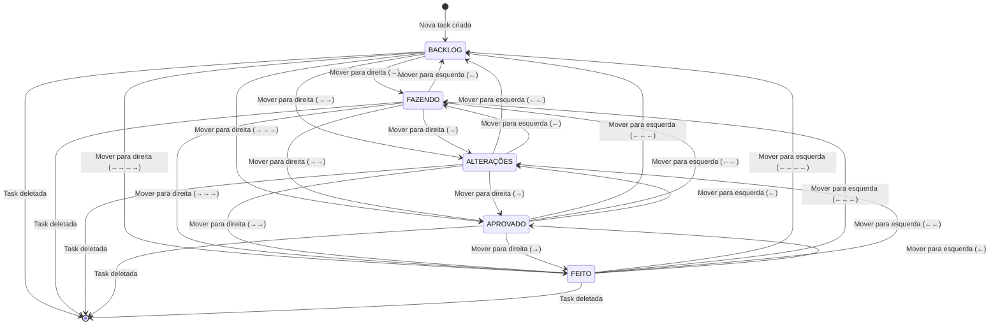
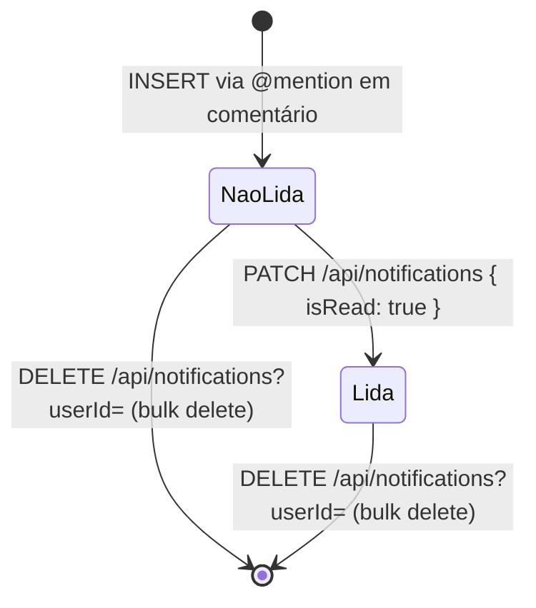
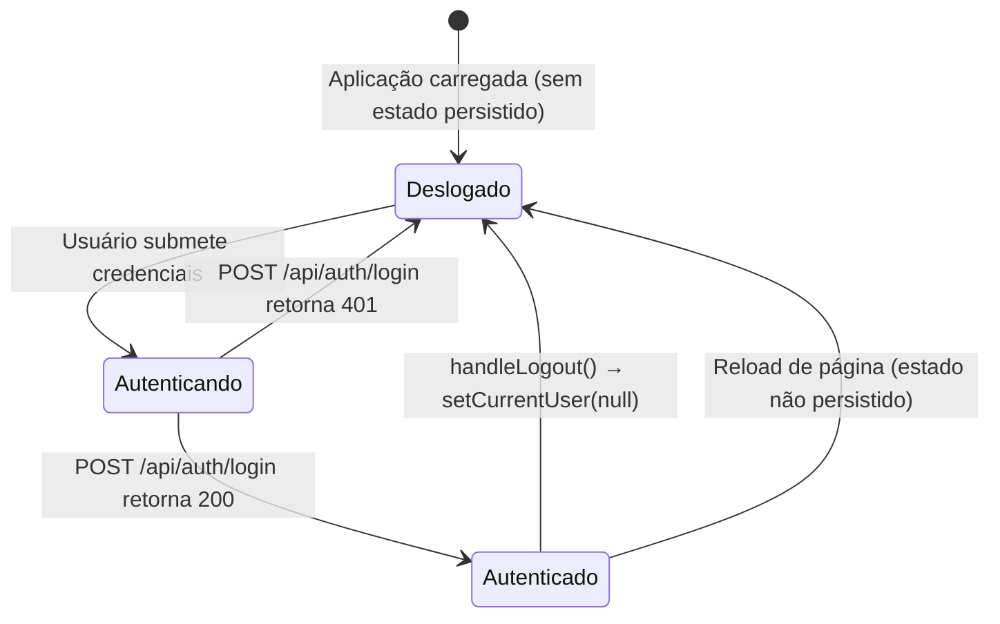

# Máquinas de Estado — BrolabTask

> Gerado pelo Detective em: 2026-05-29 | doc_level: detalhado

---

## Task — Ciclo de Vida

### Estados possíveis

| Estado (banco: `status`) | Label no UI | Descrição |
|--------------------------|-------------|-----------|
| `BACKLOG` | BACKLOG | Tarefa criada mas ainda não iniciada |
| `FAZENDO` | FAZENDO | Tarefa em execução ativa |
| `ALTERAÇÕES` | ALTERAÇÕES | Tarefa devolvida para revisão/alterações |
| `APROVADO` | APROVADO | Tarefa aprovada, aguardando entrega |
| `FEITO` | FEITO | Tarefa concluída |

> 🟢 CONFIRMADO — Origem: `app/page.tsx` (`DEFAULT_COLUMN_NAMES`) e `app/api/tasks/route.ts` (mapeamento `status → columnId`)

---

### Diagrama de estados



> **Nota:** O sistema não restringe transições de estado. Qualquer membro pode mover uma task para qualquer direção (esquerda ← ou direita →). As setas ← → ▲ ▼ no `TaskCard` permitem também reposicionamento vertical dentro da mesma coluna.

---

### Gatilhos de transição

| Ação | Endpoint | Campos atualizados |
|------|----------|--------------------|
| Mover task para coluna adjacente | `PATCH /api/tasks` | `status` (= columnId), `position` |
| Reordenar task dentro da coluna | `PATCH /api/tasks` | `position` |
| Criar task nova | `POST /api/tasks` | `status = "BACKLOG"` (padrão implícito) |
| Deletar task | `DELETE /api/tasks?id=` | — (remoção permanente) |

> 🟡 INFERIDO — Estado inicial padrão `BACKLOG`: novas tasks são criadas dentro de uma coluna específica (a coluna onde o formulário está aberto), não necessariamente BACKLOG.

---

### Fluxo típico de uma tarefa

```
[CRIAÇÃO] → BACKLOG
    ↓ desenvolvedor pega a task
FAZENDO
    ↓ desenvolvedor entrega para revisão
ALTERAÇÕES  (se necessário ajuste)  OU  APROVADO (se aprovado direto)
    ↓ aprovação final
APROVADO
    ↓ merge/deploy realizado
FEITO
```

> 🟡 INFERIDO — Fluxo típico deduzido dos nomes das colunas. Não há regras no código que enforcem este caminho.

---

## Notification — Ciclo de Vida

### Estados possíveis

| Estado | Campo | Descrição |
|--------|-------|-----------|
| Não lida | `read = false` | Recém criada, não visualizada |
| Lida | `read = true` | Usuário marcou como lida |
| Deletada | — | Removida permanentemente do banco |

### Diagrama de estados



> 🟢 CONFIRMADO — Origem: `app/api/notifications/route.ts`, `app/page.tsx`

---

### Contagem de não lidas

```typescript
const unreadCount = notifications.filter((n) => !n.read).length
```

Exibido no `NotificationBell` com `animate-pulse` quando `unreadCount > 0`.

---

## Session — Ciclo de Vida do Usuário Autenticado



> 🟢 CONFIRMADO — Origem: `app/page.tsx` (`handleLogin`, `handleLogout`)

> ⚠️ **Ausência de persistência:** Não há cookie, localStorage ou JWT. Cada reload exige novo login.
